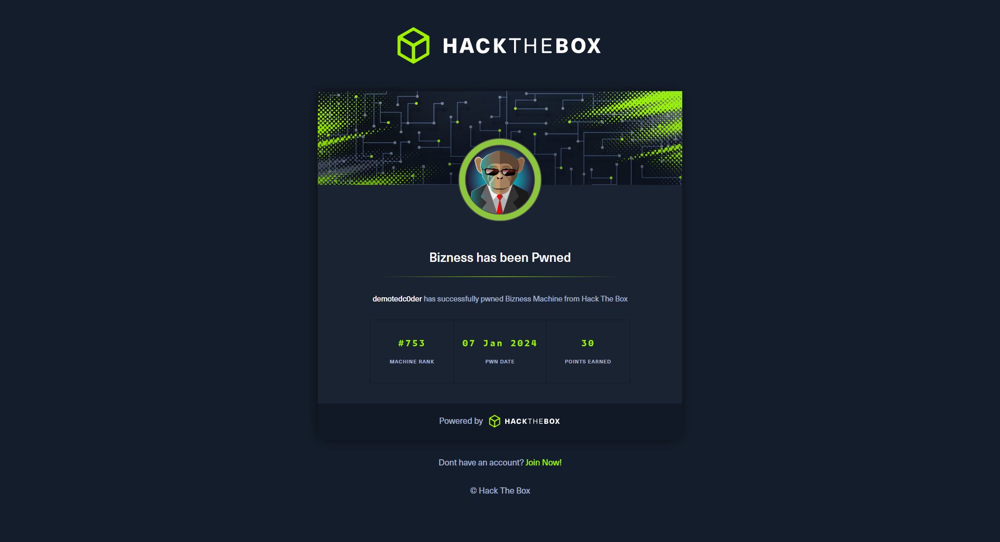

 Bizness

7th Jan 2024

### Difficulty: `Easy`

 
 
 
 
 

# User

https://github.com/jakabakos/Apache-OFBiz-Authentication-Bypass

# Root

-   dig through Derby's dir (grep -R 'Password="')
-   find the hash ( sha ;; algo:salt:hash = &dollar;SHA&dollar;d&dollar;&lt;hash&gt; )
-   (cyberchef) take the hash part only and encode it using recipe (from) base64urlSafe (to) hex without any delimiter
-   append :d to the hash (that's the salt we got from the previous hash), in this way hash:salt (in order to make it possible to hashcat it using 120 mode)
-   that's the root passwd

Give it a try and have fun

