 Codify

4th November 2023

​Machine Author(s): kavigihan
 
Prepared by: demotedc0der

### Difficulty: `Easy`
 
 
 
 
 

# Enumeration

Let's run Nmap to discover any open ports on the remote host (using the proper options):

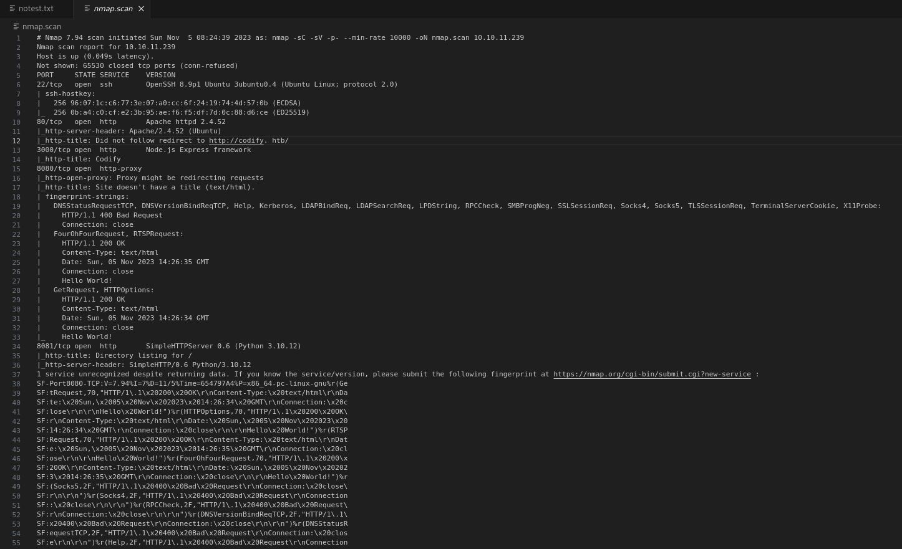

Wappalyzer is a great extension to show all the technologies used on the WebApp.

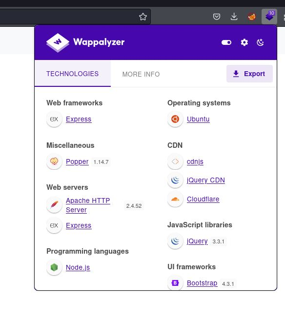

 

# Foothold

There's a simple code editor where it executes Node.js code.

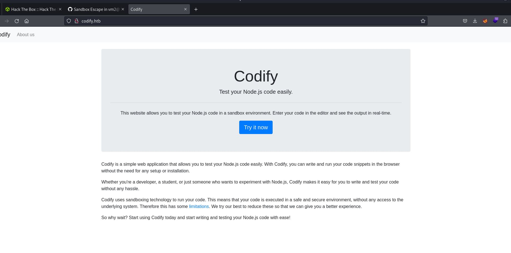

There technically exists a vulnerability in the exception sanitization of vm2, which can be used to escape the sandbox and run arbitrary code in the host context.

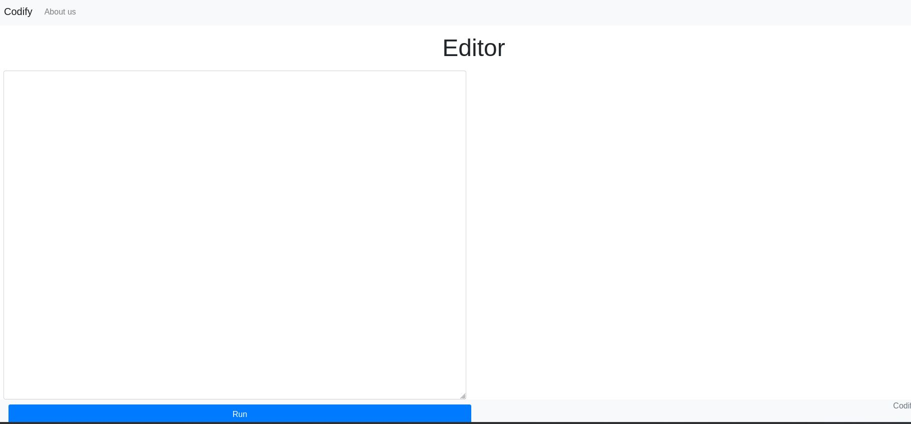

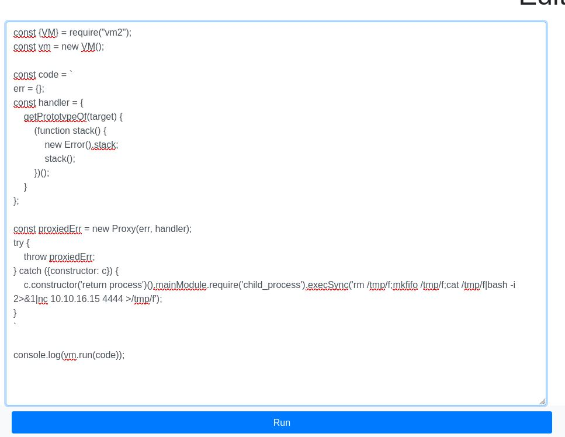

 

# Rev Shell

We successfully got the shell as user svc.

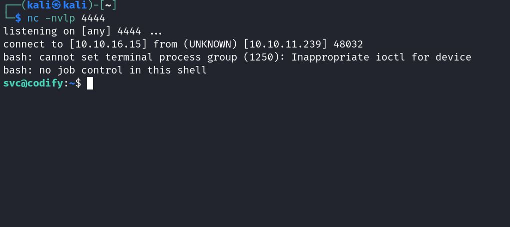

 

# Lateral Movement

Move to the /var/www/contact directory, and we can find the 'tickets.db' file.

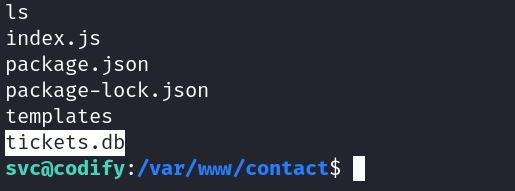

Copy this file to the local host and use sqlitebrowser to read the DB.

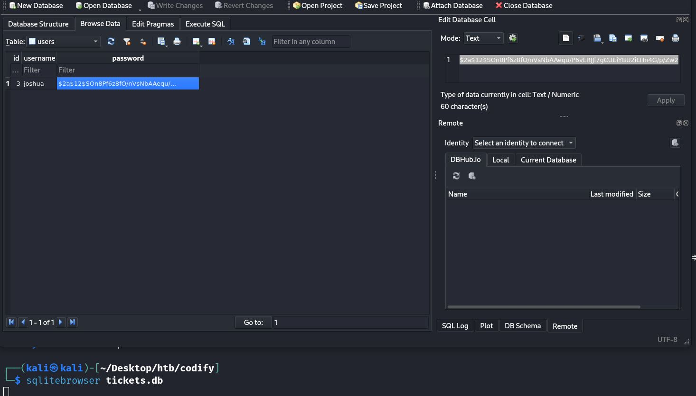

Use John to dehash it.

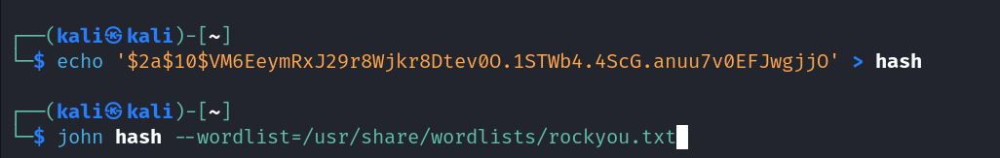

Login as Joshua using SSH, and the user flag can be obtained at /home/joshua.

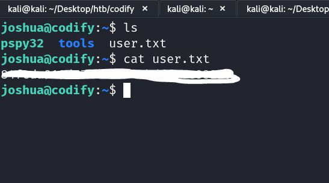

 

# Privilege Escalation

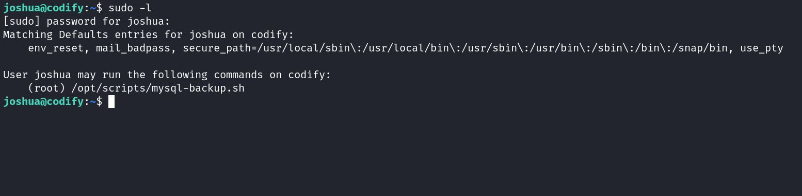

The conditional statement is the part where things get interesting.
It can be easily manipulated to make it true.

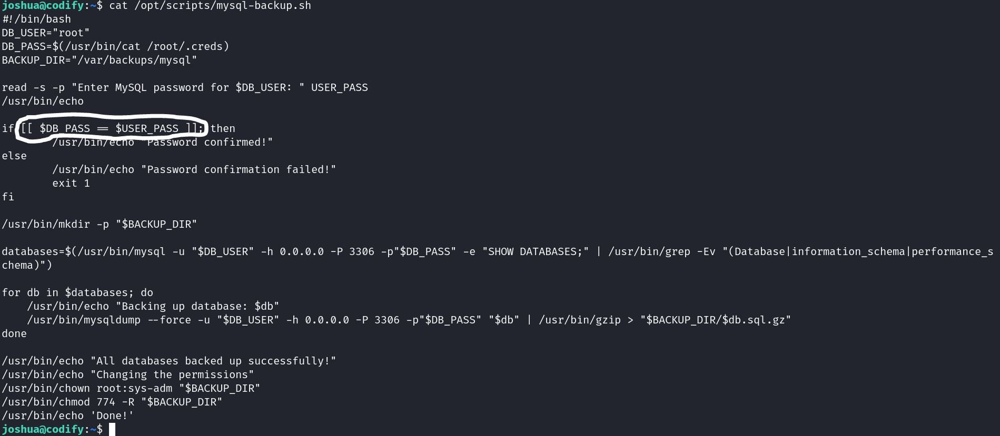

 

Create 2 SSH sessions, in one execute <b>./pspy32 -f</b> (-f option to see the actions of processes) and in the second one execute the script as sudo <b>sudo /opt/scripts/mysql_backup.sh</b>

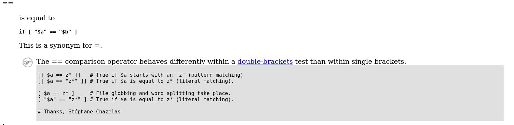

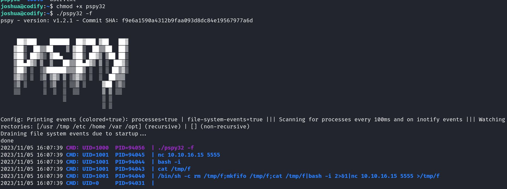

So the tricky thing here is to enter \* (asterisk) so that $DB_PASS matches with it and eventually is true.

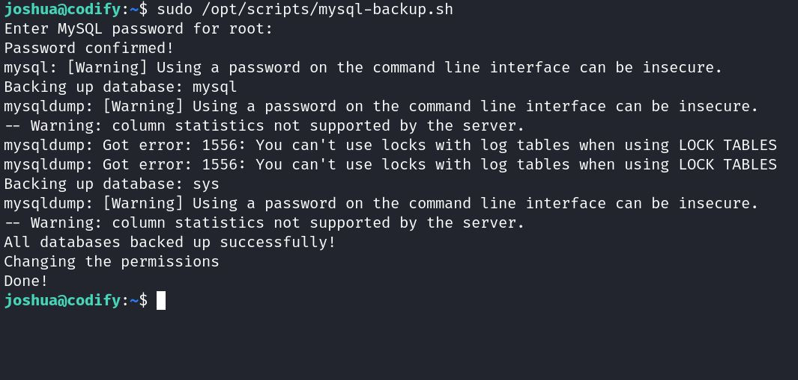

Check out the pspy's output, and from there, you can see a command is executed, -p specify the password. Use that password to log in as root.

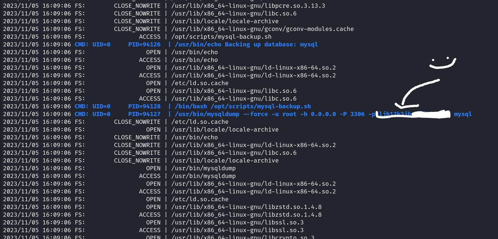

 

...and voilààà we have a root shell.

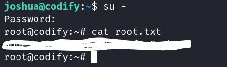

<i>References:</i>
https://gist.github.com/leesh3288/381b230b04936dd4d74aaf90cc8bb244
https://tldp.org/LDP/abs/html/comparison-ops.html
