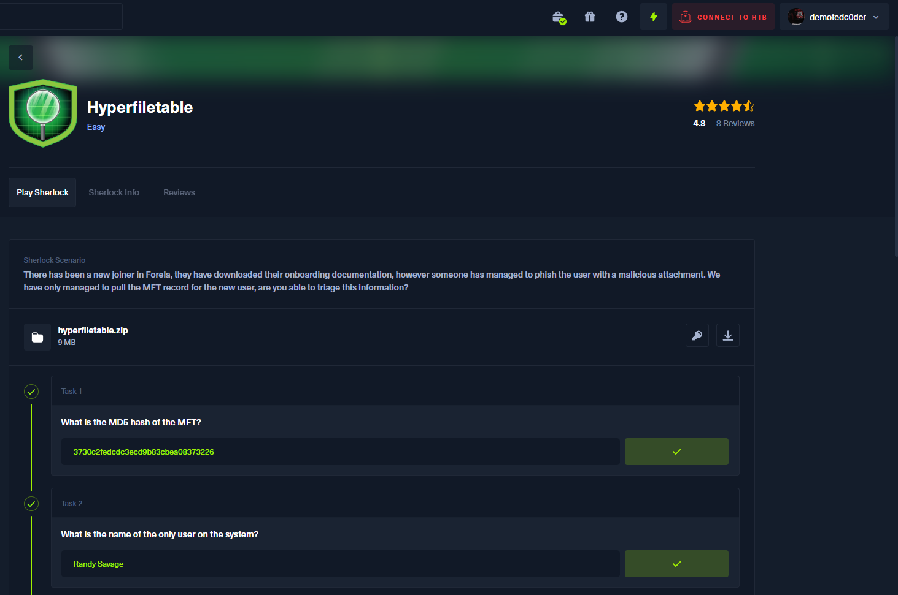
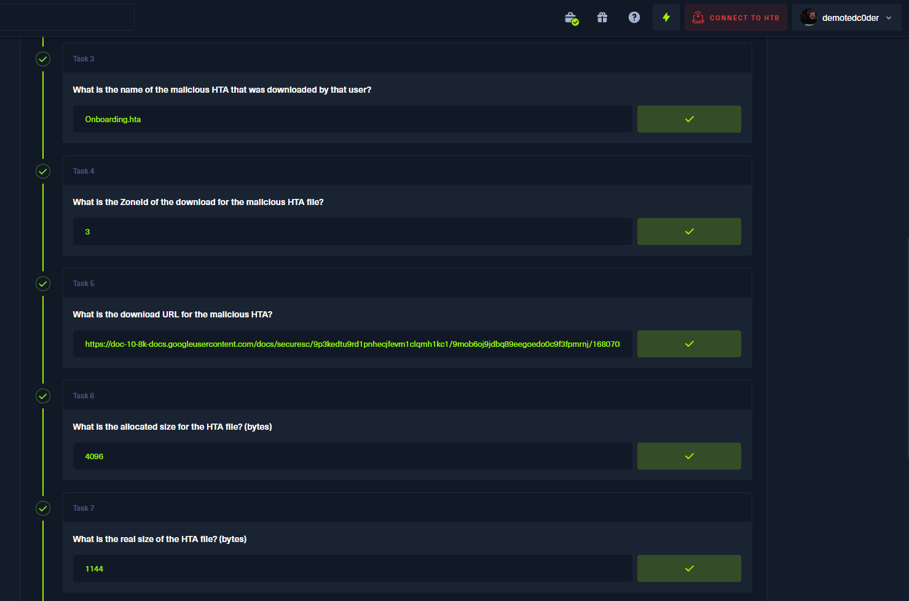
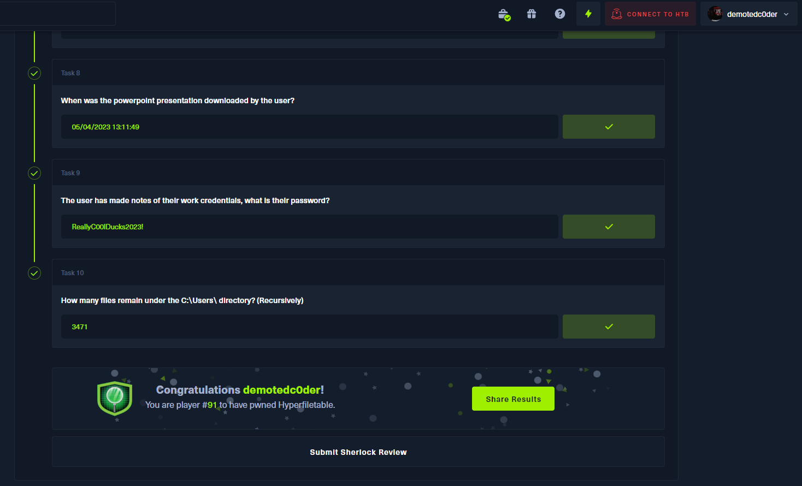

# Hyperfiletable

There has been a new joiner in Forela, they have downloaded their onboarding documentation, however someone has managed to phish the user with a malicious attachment. We have only managed to pull the MFT record for the new user, are you able to triage this information?

## Answers

<b>Please use it only as a reference; DON'T CHEAT!!!</b>
