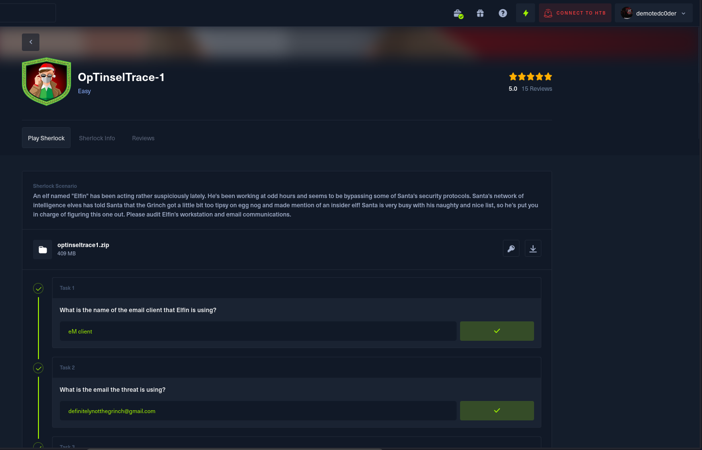
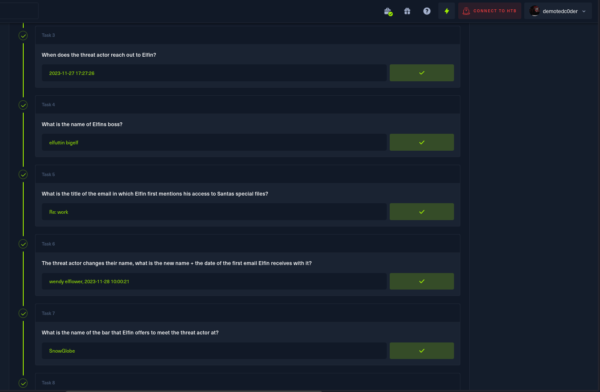
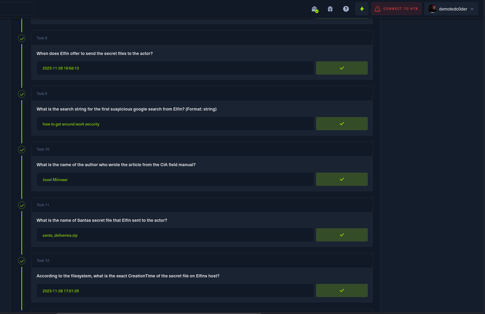
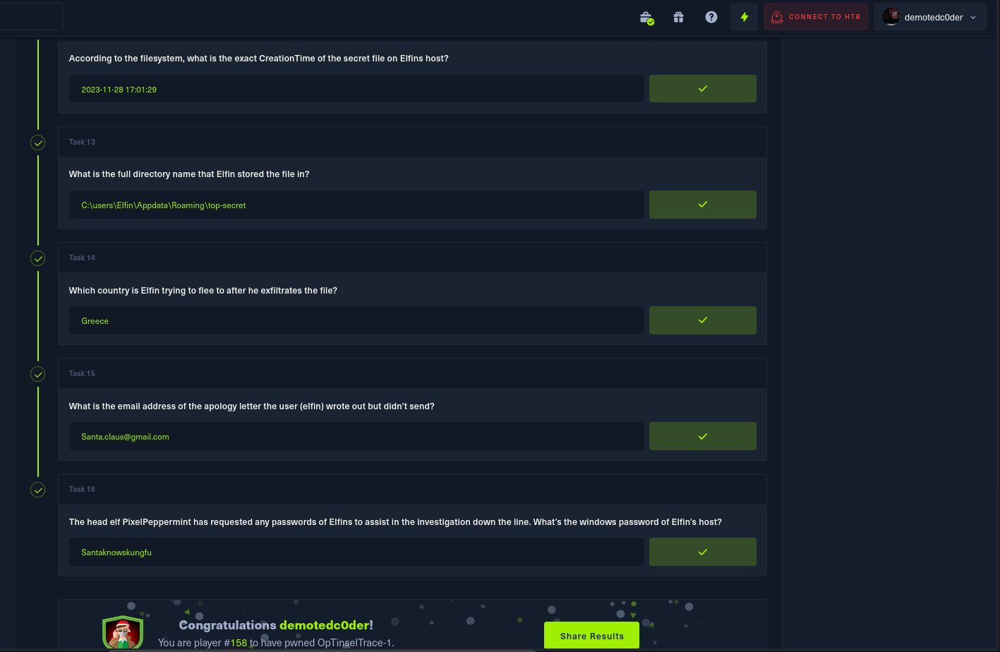

# OpTinselTrace-1

An elf named "Elfin" has been acting rather suspiciously lately. He's been working at odd hours and seems to be bypassing some of Santa's security protocols. Santa's network of intelligence elves has told Santa that the Grinch got a little bit too tipsy on egg nog and made mention of an insider elf! Santa is very busy with his naughty and nice list, so he’s put you in charge of figuring this one out. Please audit Elfin’s workstation and email communications.

## Answers

<b>Please use it only as a reference; DON'T CHEAT!!!</b>
