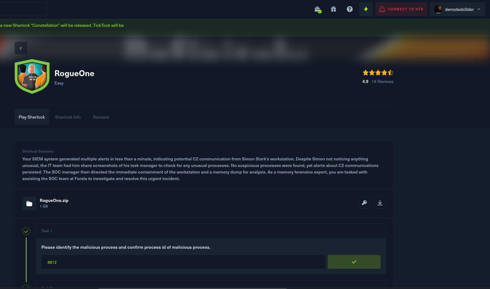
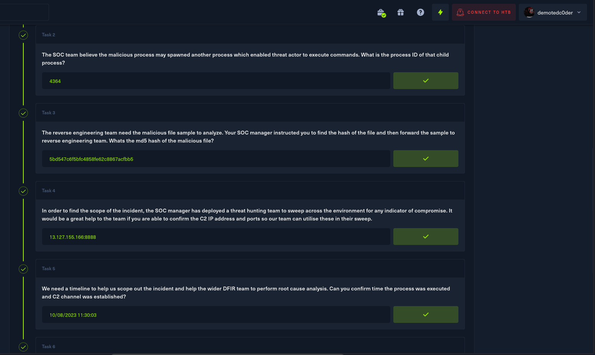
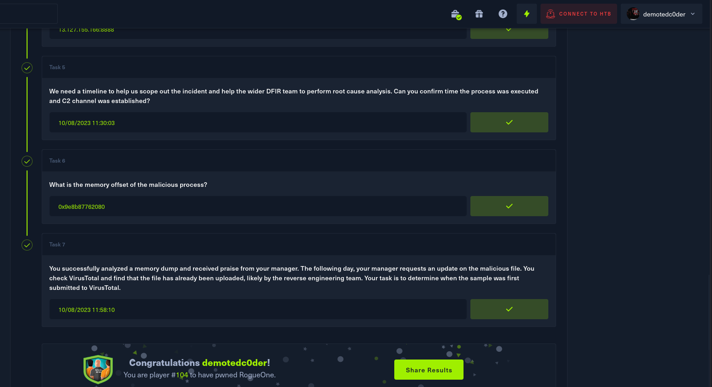

# RogueOne

Your SIEM system generated multiple alerts in less than a minute, indicating potential C2 communication from Simon Stark's workstation. Despite Simon not noticing anything unusual, the IT team had him share screenshots of his task manager to check for any unusual processes. No suspicious processes were found, yet alerts about C2 communications persisted. The SOC manager then directed the immediate containment of the workstation and a memory dump for analysis. As a memory forensics expert, you are tasked with assisting the SOC team at Forela to investigate and resolve this urgent incident.

## Answers

<b>Please use it only as a reference; DON'T CHEAT!!!</b>
