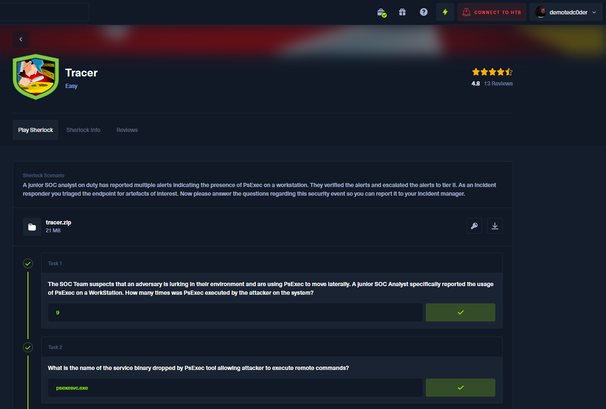

# Tracer

A junior SOC analyst on duty has reported multiple alerts indicating the presence of PsExec on a workstation. They verified the alerts and escalated the alerts to tier II. As an Incident responder you triaged the endpoint for artefacts of interest. Now please answer the questions regarding this security event so you can report it to your incident manager.

## Answers

<b>Please use it only as a reference; DON'T CHEAT!!!</b>
